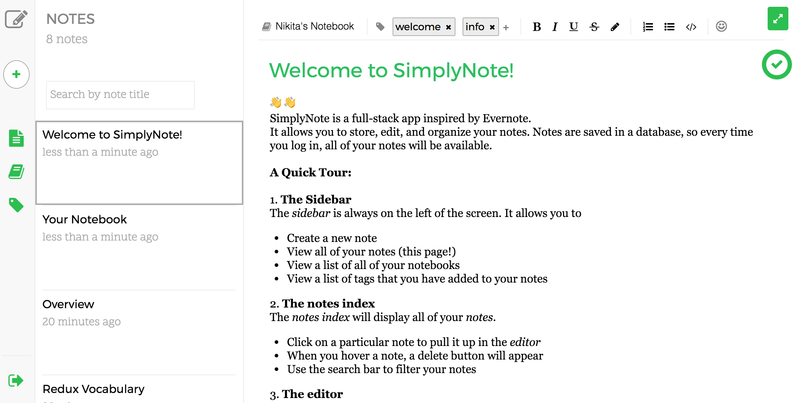
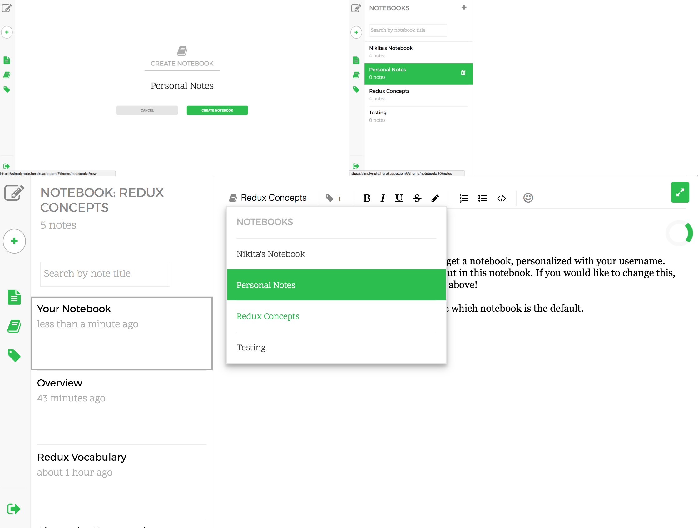

# SimplyNote

[SimplyNote][live-link] is a note-editing and organization application inspired by [Evernote][evernote]. It is a full-stack, single-page, web application built using Ruby on Rails, a PostGreSQL database, and React/Redux.

## Features
  * User accounts, with secure authentication both on the backend and on the frontend.
  * Users can create, and edit and delete notes using a built-in RichText editor.
  * Notes are autosaved regularly.
  * Notebooks hold notes, and notes can be filtered by notebook.
  * Notes can be tagged with multiple user defined tags.

### Note Rendering and Editing
The main page of SimplyNote consists of an index of all saved notes and a editor component.



```js
<aside className='notes-index'>
  <header>
    <div className='header-title'>{heading}</div>
    <div className='item-count'>{noteCount}</div>
    <form>
      <input
        className='search-bar'
        value={searchTerm}
        onChange={this.handleChange}
        placeholder='Search by note title'/>
    </form>
  </header>
  <ul className='notes-list'>
    { notes.map(
      note => <NoteIndexItem
      key={note.id}
      linkPath={`${url}/${note.id}`}
      deleteNote={()=>this.props.deleteNote(note.id)}
      {...note} />) }
  </ul>
</aside>
The `render` function of the `NotesIndex` component.
```

Clicking each note in the index list will bring up a detailed view in the editor. The editor allows for various styling options (bold, highlighting, lists, etc), which can be accessed via a toolbar above the editor, or keyboard shortcuts (for example, CMD+B bolds text)

To streamline the note-taking process, notes are automatically saved and sent back to the database. On the backend, notes are stored in a PostgreSQL table, with columns corresponding to `id`, `title`, `body`, `notebook_id`, and `updated_at`. `body` is the packaged editor state, and `notebook_id` is a reference to the notebook that contains the note.

### Filtering notes by notebook

Users have the option to organize their notes into notebooks. On the backend there is a separate database table, model, and controller for notebooks. The relationships between the `Note`, `Notebook` and `User` models are then setup using Rails associations:

  * a user `has_many` notebooks
  * a notebook `has_many` notes
  * a note `belongs_to` a single notebook

These associations, defined in the ActiveRecord models `Note` and `Notebook`, simplify the logic of sending data to the frontend.

```ruby
class Api::NotebooksController < ApplicationController
  before_action :ensure_logged_in

  def index
    @notebooks = Notebook.includes(:notes).where(author_id: current_user.id)
    @default_id = Notebook.find_by(author_id: current_user.id, is_default: true).id
  end

  def create
    @notebook = Notebook.new(notebook_params)
    @notebook.author = current_user

    if @notebook.save
      render :show
    else
      render json: @notebook.errors.full_messages, status: 422
    end
  ends
```

On the frontend, the `/notebooks` page contains an index component that fetches and renders a list of the current users notebooks. From this page, users can create or delete notebooks. Selecting a particular notebook shows the main notes page, but with the note list filtered to show only the notes in the selected notebook.

For convenience, every user starts with a personal notebook, which is created when they first create an account. By default, a new note will be placed in this personal notebook, but users can always choose which notebook they are working in via a drop-down menu above the main note editor.



### Tagging a note

In the editor, users can add multiple tags to one note. Tags are a separate table in the database, and have a many-to-many relationship with notes via a join table. When adding a new tag to a note, if the tag is already in the database, then it is simply added to the note. If the tag does not yet exist, it is automatically created.

Similarly to notebooks, the `/tags` page has a list of tags, sorted alphabetically. Clicking on a tag will show all of the notes that correspond to a particular tag.

## Project Design

SimplyNote was designed and built in a two week period. View the original [proposal][dev-readme], which includes MVP features, an implementation timeline and more extensive documentation.

## Technologies

Rails is an MVC framework that allows a straightforward setup of a PostgreSQL relational database and corresponding RESTful API. Since React.js takes care of rendering all HTML, the Rails API is setup to only serve JSON. On the frontend, AJAX requests are sent and received using jQuery.

From here, the received JSON objects corresponding notes, notebooks and tags are parsed and rendered by React following the Redux implementation of the Flux methodology. The Redux data flow is unidirectional, and the state is setup to be modular, - there are separate reducers and actions for notes, the editor state, notebooks, and tags.

Once rendered,RichText editing of notes is achieved using [Draft.js][draft], an open source library developed by Facebook.

For more details on includes packages, see [dependencies][dependencies]

## Future Directions

I plan to continue adding to SimplyNote as time permits. Some ideas for next steps include

  * Note sharing between Users
  * Improved search features using the Fuzy.js external library - this will allow searching for notes by title, body, tags, etc.
  * Change-logs for notes - record history of changes to individual notes
  * Adding unit, integration and end-to-end tests
  * Using [Electron][electron] to deploy SimplyNote as a cross-platform desktop app


[evernote]: https://evernote.com/
[dev-readme]: docs/README.md
[live-link]: http://www.simply-note.me
[draft]: https://draftjs.org
[dependencies]: docs/dependencies.md
[electron]: https://electron.atom.io/
